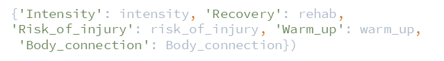
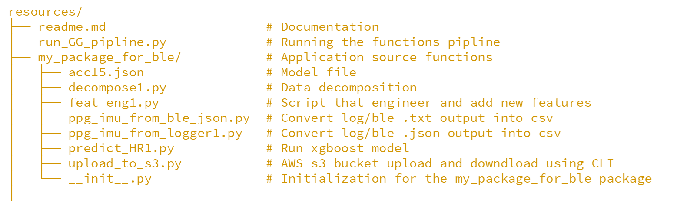
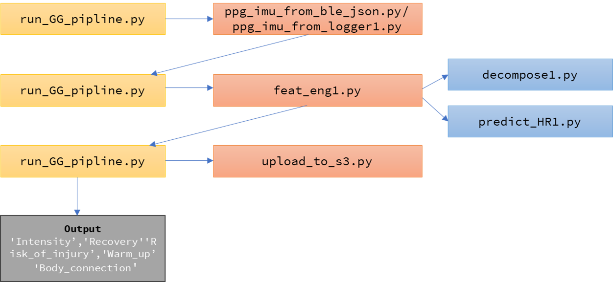

## ** Welcome to GG_algorithm pipline**

"run_GG_pipline.py" calls the log file from DB/server, read and run the functions to return the values:  

#### **Before running you need to:**
1. Provide local path or DB url change the path in 'run_GG_pipline.py'.
2. Install the requirements

#### **The pipeline do the following:**
1. The first function call logger output from local path or DB url
 and run the function that convert it to csv.
2. The second function add new features to data. 
3. Uploading the output csv to s3 bucket (need to change it to once a day)
4. Sending response to localhost/server.
The directory structure and app pipline:

